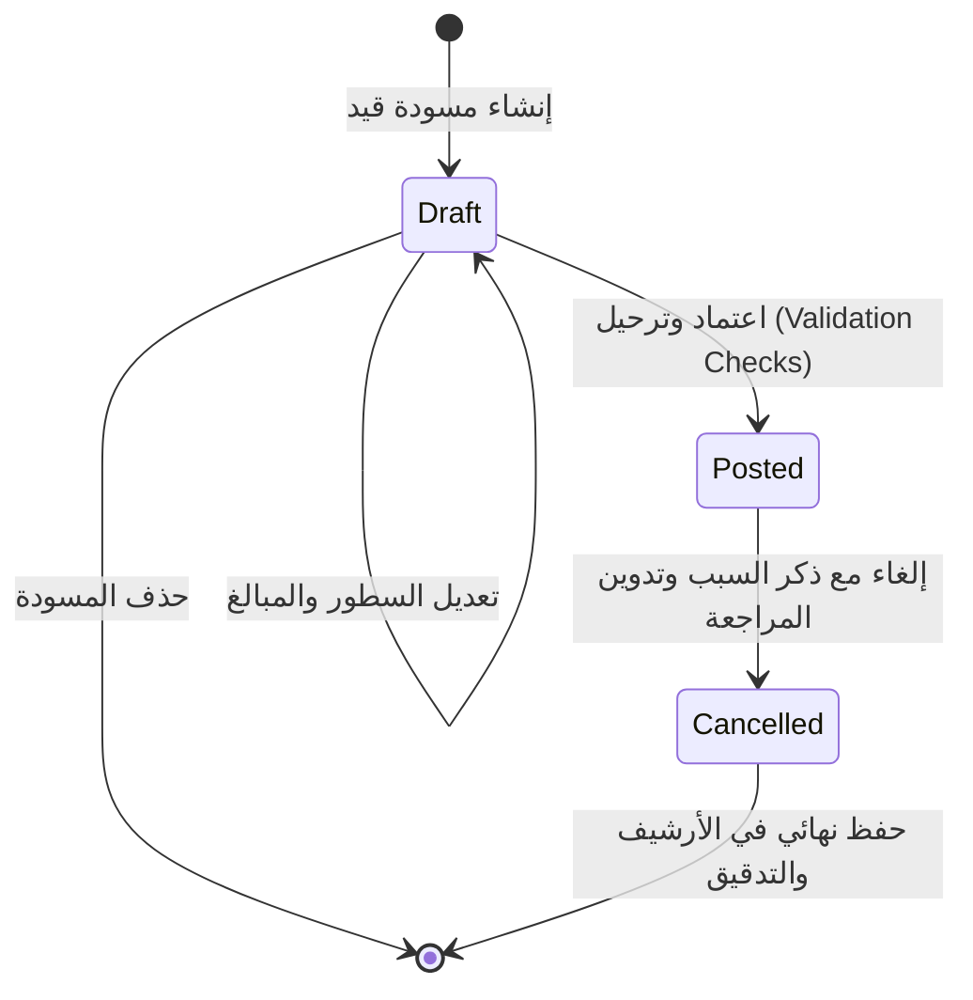

# محرك المحاسبة ومعايير القيد المزدوج (Accounting Engine & Double-Entry Principles)
## نظام سيجما للمحاسبة والمقاولات (Sigma Accounting System)

يمثل `AccountingEngine` القلب النابض للنظام ومصدر الحقيقة المالي الأوحد (**Single Source of Truth**). تم تصميمه بحيث لا يتم احتساب أي أرصدة مالية من حالة واجهة المستخدم مطلقاً، بل تشتق كافة التقارير والموازين والقوائم الختامية ديناميكياً من واقع القيود المحاسبية المرحلة وسطورها.

---

## 1. قواعد القيد المزدوج الإلزامية (Double-Entry Core Rules)

### القاعدة الذهبية:
$$\sum \text{Debit} = \sum \text{Credit}$$

لا يمكن ترحيل أو اعتماد أي قيد يومية ما لم تكن القيمة الإجمالية للمدين مساوية تماماً للقيمة الإجمالية للدائن حتى آخر فلس:
```dart
if ((totalDebit - totalCredit).abs() > 0.001) {
  throw ValidationException('القيد غير متوازن: إجمالي المدين يجب أن يساوي إجمالي الدائن تماماً.');
}
```

### التنافي الحصري بين المدين والدائن في السطر الواحد (Mutual Exclusivity):
* إذا كان المدين $> 0$ يجب أن يكون الدائن $= 0$.
* إذا كان الدائن $> 0$ يجب أن يكون المدين $= 0$.
* يمنع منعاً باتاً أن يحتوي السطر الواحد على قيمتين موجبتين في المدين والدائن معاً.
* لا تقبل المبالغ السالبة في القيود.

### شرط الحد الأدنى لأسطر القيد:
* كل قيد يومية يجب أن يحتوي على سطرين على الأقل (طرف مدين وطرف دائن).

### شرط الفترة المالية المفتوحة (Open Accounting Period):
* يتم التحقق آلياً من تاريخ القيد: إذا كان التاريخ يقع ضمن فترة محاسبية شهرية مقفلة (`is_closed = 1`)، يرفض النظام حفظ أو ترحيل القيد ويظهر تحذيراً بوجوب إعادة فتح الفترة من قبل المدير المالي.

---

## 2. إدارة دورة حياة القيود (Journal Lifecycle & Immutability)



1. **مسودة (Draft)**:
   * قابلة للتعديل والإضافة والحذف.
   * لا تؤثر على موازين المراجعة ولا تظهر في الأستاذ العام ولا القوائم الختامية.
2. **مرحل (Posted)**:
   * **غير قابل للتعديل الصامت أو الحذف نهائياً**.
   * يدخل مباشرة في كافة الموازين والتقارير المالية.
3. **ملغى (Cancelled)**:
   * عند حدوث خطأ في قيد مرحل، يتم إلغاؤه رسمياً مع إجبار المستخدم على إدخال **سبب الإلغاء** (`cancellation_reason`).
   * يتم استبعاده من حركة الحسابات الختامية مع الاحتفاظ الكامل به في سجل التدقيق ومسار المراجعة (`AuditLog`).

---

## 3. محرك تقارير الحسابات الختامية

### أ. ميزان المراجعة بالمجاميع وبالأرصدة (Trial Balance)
يستخرج النظام الميزان في صيغتين مع التحقق الفوري من حالة التوازن:
1. **ميزان المراجعة بالمجاميع (By Totals)**:
   * يعرض لكل حساب: إجمالي الحركات المدينة وإجمالي الحركات الدائنة والفرق.
2. **ميزان المراجعة بالأرصدة (By Balances)**:
   * الأعمدة: رصيد أول مدة (مدين/دائن) + حركة الفترة (مدين/دائن) + رصيد آخر المدة (مدين/دائن).
   * **معادلة التوازن الدائمة**:
     $$\sum \text{Closing Debit} == \sum \text{Closing Credit}$$
   * يظهر النظام مؤشر حالة واضح: `متزن Balanced` بالأخضر أو `غير متزن Out of Balance` بالأحمر.

### ب. قائمة الدخل (الأرباح والخسائر - Income Statement)
تعتمد على الحسابات الإسمية (الإيرادات والمصروفات) للفترة المحددة:
1. **صافي الإيرادات والمبيعات** = مبيعات العمليات - مردودات المبيعات.
2. **تكلفة العمليات والمبيعات (Direct Costs)** = مشتريات مواد + مقاولو باطن + عمالة موقع + إيجار معدات ومصاريف مواقع.
3. **مجمل الربح (Gross Profit)** = صافي الإيرادات - تكلفة المبيعات.
4. **المصروفات التشغيلية والإدارية** = مرتبات الإدارة + إيجارات + استهلاك + مصاريف عمومية.
5. **صافي الربح قبل الضريبة** = مجمل الربح - المصروفات الإدارية + إيرادات أخرى.
6. **صافي أرباح العام (Net Profit)** = صافي الربح بعد خصم ضريبة الأرباح التجارية والصناعية.

### ج. الميزانية العمومية والمركز المالي (Balance Sheet)
تطبق المعادلة المحاسبية التاريخية الخالدة:
$$\text{Assets} = \text{Liabilities} + \text{Equity}$$

حيث يربط النظام صافي أرباح الفترة آلياً بحقوق الملكية (`Equity`):
* **الأصول المتداولة**: الصندوق، البنوك، العملاء وأوراق القبض، شيكات تحت التحصيل، مصاريف مقدمة.
* **الأصول الثابتة**: معدات وسيارات، أجهزة وكرفانات، يخصم منها مجمع الإهلاك.
* **الخصوم المتداولة**: الموردين، مقاولو الباطن المستحق، مصلحة الضرائب (ض.ق.م وخصم وتحصيل)، مصروفات مستحقة.
* **حقوق الملكية**: رأس المال، جاري الشركاء، الأرباح المرحلة، وصافي ربح الفترة الحالية المستخرج من قائمة الدخل.

---

## 4. محاسبة مقاولي الباطن (Subcontractor Accounting)

في شركات المقاولات، يمثل مقاول الباطن التزاماً ومحرك تكلفة في آن واحد:
* عند استحقاق مستخلص المقاول:
  * **مدين**: مصروفات عمليات ومواقع / بند تحليلي (خرسانة/حدادة/نجارة) / كود المشروع.
  * **دائن**: حساب مقاولين باطن (مع تخصيص `contractor_id`).
* عند صرف دفعة نقدية أو بنكية للمقاول:
  * **مدين**: حساب مقاولين باطن (مع تخصيص `contractor_id`).
  * **دائن**: الصندوق أو البنك.
* **كشف حساب المقاول**: يعرض رصيد أول المدة، مسحوبات ودفعات المقاول، المستخلصات المعتمدة، والرصيد التراكمي اللحظي المستحق له أو عليه.

---

## 5. محاسبة وتحليل تكاليف المشروعات (Project Cost Tracking)

يقوم المحرك بربط كل سطر قيد تابع لتكلفة أو إيراد بمشروع محدد (`project_id`) وبند تحليلي (`analytical_item_id`)، مما يتيح استخراج تقرير متكامل لكل مشروع يشمل:
* الإيرادات المحققة للمشروع.
* التكاليف المباشرة: (مواد مباشرة، مقاولو باطن، عمالة موقع، معدات).
* التكاليف غير المباشرة ومصروفات الموقع.
* مجمل ربح المشروع ونسبة هامش الربحية:
  $$\text{Margin \%} = \frac{\text{Revenue} - \text{Total Cost}}{\text{Revenue}} \times 100$$
* توزيع التكلفة حسب البنود التحليلية (خرسانات، حديد، كهرباء، تشطيبات، إلخ).
