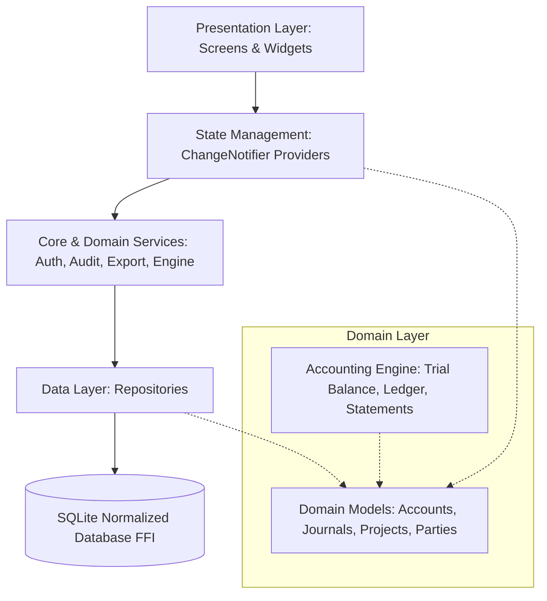

# البنية المعمارية للنظام (Software Architecture)
## نظام سيجما للمحاسبة والمقاولات (Sigma Accounting System)

تم بناء نظام **سيجما** باتباع المعمارية النظيفة ومبادئ تصميم النظم المؤسسية (Clean Architecture & SOLID Principles)، مع الفصل التام بين طبقة العرض، وطبقة الأعمال والمنطق المحاسبي، وطبقة البيانات.

---

## 1. الطبقات المعمارية (Layered Architecture)

### أ. طبقة النواة والثوابت (`lib/core/`)
* `theme/`: الألوان المالية الموحدة (`AppColors`)، ونمط واجهة المستخدم (`AppTheme`) الداعم للخط العربي الأصيل (Cairo)، والسمات الفاتحة والداكنة (Light/Dark Themes).
* `constants/`: أنواع الحسابات، حالات القيود، الصلاحيات الـ 18، والنصوص والمصطلحات المحاسبية العربية.
* `database/`: تعريف جداول قاعدة البيانات الـ 19 (`DatabaseSchema`)، بذور البيانات التأسيسية للمقاولات المصرية (`DatabaseSeedData`)، ومساعد قاعدة البيانات المكتبي (`DatabaseHelper`).
* `utils/`: دوال تنسيق العملات والتواريخ والكميات (`Formatters`)، وقواعد التحقق الصارم (`Validators`)، ومعالجة البحث الذكي في النصوص العربية وتطبيع الهمزات والتشكيل (`ArabicTextHelper`).
* `services/`: خدمات الأمان والمصادقة (`AuthService`)، سجل المراجعة التدقيقي (`AuditService`)، النسخ الاحتياطي واستعادة البيانات (`BackupService`)، والتصدير والطباعة باللغة العربية (`ExportService`)، والاستيراد الذكي من إكسيل (`ImportService`).

### ب. طبقة البيانات والمستودعات (`lib/data/repositories/`)
تقوم بعزل العمليات المباشرة على قاعدة البيانات وتطبيق قواعد السلامة:
* `AccountRepository`: معالجة دليل الحسابات ومنع الحذف للحسابات ذات الحركات وترقيتها لـ Soft-Deactivation.
* `JournalRepository`: معالجة قيود اليومية، حماية القيود المرحلة من التعديل الصامت، وأرشفة القيود الملغاة مع سبب الإلغاء.
* `FiscalRepository`: إدارة السنوات والفترات ومنع القيد في الفترات المقفلة.
* `ProjectRepository`, `ContractorRepository`, `PartyRepository`, `AnalyticalRepository`, `UserRepository`, `AuditRepository`, `OpeningBalanceRepository`.

### ج. طبقة النطاق والمحرك المحاسبي (`lib/domain/`)
* `models/`: كائنات البيانات المحاسبية النقية الخالية من أي اعتمادية على واجهة المستخدم.
* `services/accounting_engine.dart`: المحرك المحاسبي المستقل الذي يحسب الأستاذ العام، ميزان المراجعة، تكلفة المشروعات، كشوف حسابات المقاولين، وقائمتي الدخل والمركز المالي من واقع سطور القيود فقط.

### د. طبقة العرض والواجهات (`lib/presentation/`)
* `providers/`: إدارة حالة التطبيق باستخدام نمط `Provider` و`ChangeNotifier`:
  * `AuthProvider`: حالة تسجيل الدخول، المستخدم الحالي، والتحقق الفوري من الصلاحيات.
  * `AccountingProvider`: تحميل الدليل والمشروعات والمقاولين والمؤشرات القيادية للمنظومة.
  * `JournalProvider`: محرر قيود اليومية التفاعلي، التحقق اللحظي من التوازن، ونماذج القيود السريعة.
  * `ReportProvider`: تحميل وتشغيل كشوف الأستاذ والموازين والقوائم الختامية.
  * `ThemeProvider`: التبديل الفوري بين الوضع الفاتح والداكن.
* `screens/`: شاشات سطح المكتب المتكاملة بتوجيه RTL عربي أصيل.
* `widgets/`: المكونات القابلة لإعادة الاستخدام: الجداول المالية المتجاوبة، بطاقات الـ KPI، شارات الحالة، ومؤشرات توازن القيود.

---

## 2. إدارة الأمان والصلاحيات (RBAC - Role-Based Access Control)

يقوم النظام على نموذج صلاحيات دقيق يتألف من 18 صلاحية مقسمة على أدوار العمل المؤسسي:
* **مسؤول النظام (`admin`)**: صلاحيات مطلقة تشمل التهيئة، إضافة المستخدمين، النسخ الاحتياطي، وإلغاء القيود.
* **رئيس الحسابات (`accountant`)**: صلاحية اعتماد وترحيل القيود، إقفال الفترات، وإصدار التقارير والقوائم الختامية.
* **مراجع مالي (`reviewer`)**: مراجعة القيود والأستاذ العام والموازين دون حق الحذف أو تعديل الإعدادات.
* **مدخل بيانات (`data_entry`)**: إنشاء مسودات القيود اليومية وعرض دليل الحسابات والمشروعات.
* **قارئ ومستعلم (`viewer`)**: استعراض التقارير فقط.

---

## 3. حماية البيانات ومسار التدقيق (Audit Trail & Backup)

* **التدقيق التلقائي**: يتم تدوين كل عملية (تسجيل دخول، إنشاء قيد، تعديل مسودة، ترحيل، إلغاء، قفل فترة، نسخ احتياطي) في جدول `audit_logs` متضمناً اسم المستخدم، التوقيت، ونوع العملية.
* **سلامة قاعدة البيانات**: استخدام SQLite WAL Mode مع عمل `wal_checkpoint(FULL)` الإجباري قبل أخذ النسخ الاحتياطية لضمان عدم تلف الملفات أثناء النسخ المباشر.
