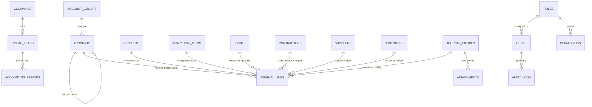

# توثيق قاعدة البيانات المحاسبية (Database Schema Documentation)
## نظام سيجما للمحاسبة والمقاولات (Sigma Accounting System)

يعتمد نظام **سيجما** على قاعدة بيانات علائقية موحدة (Normalized Relational Database) باستخدام SQLite مدعومة بمحرك FFI على بيئات سطح المكتب، ومفعل بها التحقق الصارم من المفاتيح الأجنبية (`PRAGMA foreign_keys = ON;`).

---

## 1. مخطط الكيانات والعلاقات (Entity Relationship Overview)

---

## 2. تفصيل الجداول وقواعد البيانات (19 جداول معيارية)

### 1. `companies` (الشركات والمؤسسات)
* `id`: المعرف الأساسي (INTEGER PK AUTOINCREMENT).
* `name_ar`: اسم الشركة باللغة العربية (VARCHAR NOT NULL).
* `name_en`: اسم الشركة باللغة الإنجليزية (VARCHAR).
* `tax_number`: الرقم الضريبي (VARCHAR).
* `commercial_registry`: رقم السجل التجاري (VARCHAR).
* `address`: العنوان والفرع (TEXT).
* `phone`: أرقام التواصل (VARCHAR).
* `currency`: عملة القيد الافتراضية (EGP).
* `is_active`: حالة تفعيل الشركة (INTEGER 1/0).

### 2. `fiscal_years` (السنوات المالية)
* `id`: المعرف الأساسي (INTEGER PK).
* `company_id`: معرّف الشركة (FK -> companies.id).
* `name`: اسم السنة المالية (مثال: 2026).
* `start_date`: تاريخ البداية (YYYY-MM-DD).
* `end_date`: تاريخ النهاية (YYYY-MM-DD).
* `is_closed`: حالة الإقفال المالي النهائي (1 مقفل / 0 مفتوح).

### 3. `accounting_periods` (الفترات المحاسبية الشهرية)
* `id`: المعرف الأساسي.
* `fiscal_year_id`: السنة التابعة لها (FK -> fiscal_years.id).
* `period_number`: رقم الشهر (1 إلى 12).
* `name`: مسمى الفترة (مثال: يناير 2026).
* `start_date` / `end_date`: نطاق الفترة.
* `is_closed`: حالة قفل الفترة الشهرية لمنع الترحيل بعد اعتماد الموازين.

### 4. `account_groups` (المجموعات المحاسبية)
* `id`: المعرف الأساسي.
* `code`: كود المجموعة (1 للأصول، 2 للالتزامات، 3 لحقوق الملكية، 4 للإيرادات، 5 للمصروفات).
* `name`: اسم المجموعة المحاسبية.
* `category`: التصنيف الرئيسي (`asset`, `liability`, `equity`, `revenue`, `expense`).

### 5. `accounts` (دليل الحسابات الشجري - Chart of Accounts)
* `id`: المعرف الأساسي.
* `code`: كود الحساب الفريد والمفهرس (مثال: 1101 للصندوق، 2102 للمقاولين).
* `name`: الاسم بالإنجليزية / الرمزي.
* `name_ar`: الاسم العربي المحاسبي الدقيق.
* `parent_id`: الحساب الرئيسي التابع له (FK ذاتي -> accounts.id).
* `account_type`: نوع الحساب (`asset`, `liability`, `equity`, `revenue`, `expense`).
* `sub_type`: النوع الفرعي (`currentAsset`, `fixedAsset`, `currentLiability`, `directCost`, إلخ).
* `normal_balance`: طبيعة الحساب القياسية (`debit` مدين أو `credit` دائن).
* `level`: مستوى الحساب في الشجرة (1 رئيسي إلى 5 تحليلي).
* `is_group`: هل الحساب تجميعي (1 نعم، لا يقبل قيود مباشرة / 0 تفصيلي يقبل القيود).
* `is_active`: حالة التفعيل (الحسابات التي بها قيود لا تحذف بل تعطل عبر Soft-Deactivation).

### 6. `projects` (المشروعات ومراكز التكلفة)
* `id`: المعرف الأساسي.
* `code`: كود المشروع (مثال: PRJ-001).
* `name`: اسم المشروع (نيوم أكتوبر، بيراميدز، بارك استريت، إلخ).
* `client`: اسم العميل أو الجهة المالكة.
* `start_date` / `expected_end_date` / `actual_end_date`: تواريخ التنفيذ.
* `budget`: الموازنة التقديرية المعتمدة للمشروع.
* `status`: حالة المشروع (`active`, `completed`, `suspended`).
* `notes`: ملاحظات هندسية ومالية.

### 7. `analytical_items` (بنود التحليل الهندسي والمصروفات)
* يمثل التصنيف التحليلي لتكلفة العمليات مفصولاً تماماً عن الوحدات:
  * خرسانة مسلحة، حدادة، نجارة مسلحة، كهرباء، مباني، بياض ومحارة، سيراميك، عمالة موقع، إلخ.
* `id`, `code`, `name`, `category`, `is_active`.

### 8. `units` (وحدات القياس الهندسية والكمية)
* جدول مستقل لا يخلط مع البنود التحليلية:
  * طن، م3، متر طولي، متر مسطح، بالقطعة، بالسقف، باليومية، بالفيلا.
* `id`, `code`, `name`, `symbol`.

### 9. `contractors` (مقاولو الباطن)
* `id`, `code`, `name`, `phone`, `tax_number`, `address`, `project_id`, `opening_balance`, `is_active`.

### 10. `suppliers` (الموردين)
* `id`, `code`, `name`, `phone`, `tax_number`, `opening_balance`, `is_active`.

### 11. `customers` (العملاء والمستخلصات)
* `id`, `code`, `name`, `phone`, `tax_number`, `opening_balance`, `is_active`.

### 12. `opening_balances` (الأرصدة الافتتاحية المعتمدة)
* `id`, `fiscal_year_id`, `account_id`, `project_id`, `analytical_item_id`, `debit`, `credit`, `description`.
* يخضع لشرط التوازن: `SUM(debit) == SUM(credit)`.

### 13. `journal_entries` (رأس قيد اليومية)
* `id`: المعرف الرقمي.
* `entry_number`: رقم القيد التسلسلي المحاسبي (مثال: JV-2026-0001).
* `date`: تاريخ حدوث العملية (YYYY-MM-DD).
* `description`: شرح القيد المحاسبي الشامل.
* `reference_number`: رقم المرجع أو الفاتورة أو الشيك أو المستخلص.
* `project_id`: المشروع الرئيسي المرتبط (اختياري على مستوى الرأس).
* `status`: حالة القيد (`draft` مسودة، `posted` مرحل معتمد، `cancelled` ملغى مع الحفظ).
* `cancellation_reason`: سبب الإلغاء إذا تم إلغاؤه (لحماية مسار المراجعة).
* `created_by`, `created_at`, `posted_by`, `posted_at`.

### 14. `journal_lines` (سطور وأطراف القيد المزدوج)
* `id`: المعرف الأساسي.
* `journal_entry_id`: رأس القيد (FK -> journal_entries.id CASCADE ON DELETE DRAFT).
* `account_id`: الحساب المتأثر (FK -> accounts.id).
* `project_id`: ربط التكلفة أو الإيراد بالمشروع.
* `analytical_item_id`: البند التحليلي للتكلفة.
* `unit_id`: وحدة القياس عند توفر كميات.
* `quantity`: الكمية المنفذة أو الموردة.
* `unit_price`: سعر الوحدة.
* `debit`: المدين (أكبر من صفر فقط إذا كان الدائن صفر).
* `credit`: الدائن (أكبر من صفر فقط إذا كان المدين صفر).
* `contractor_id`: ربط بسجل مقاول الباطن.
* `supplier_id`: ربط بسجل المورد.
* `customer_id`: ربط بسجل العميل.
* `line_number`: ترتيب السطر في القيد.
* `description`: بيان وتفصيل السطر.

### 15. `roles` & 16. `permissions` & 17. `users` (صلاحيات وأمان النظام)
* أدوار محددة مسبقاً: مسؤول النظام (`admin`)، رئيس الحسابات (`accountant`)، مراجع مالي (`reviewer`)، مدخل بيانات (`data_entry`)، قارئ تقارير (`viewer`).
* 18 صلاحية مفصلة تشمل إنشاء القيود، ترحيلها، قفل الفترات، وتصدير التقارير.
* تشفير كلمات المرور باستخدام `SHA-256`.

### 18. `audit_logs` (سجل المراجعة والتدقيق الإلزامي)
* تسجيل كل حركة تمت في النظام: اسم المستخدم، نوع العملية (`action`)، الكيان (`record_type`)، معرف السجل، التفاصيل، والتاريخ بدقة الثانية.

### 19. `attachments` (المرفقات ومستندات الإثبات)
* تخزين الفواتير، صور الشيكات، ومستخلصات المقاولين المرفقة بكل قيد.

---

## 3. الفهارس ومؤشرات الأداء (Database Indexes)

تم إنشاء فهارس مخصصة لتسريع استعلامات التقارير والأستاذ العام وموازين المراجعة:
* `idx_journal_lines_entry`: مفهرس على `journal_entry_id`.
* `idx_journal_lines_account`: مفهرس على `account_id`.
* `idx_journal_lines_project`: مفهرس على `project_id`.
* `idx_journal_lines_contractor`: مفهرس على `contractor_id`.
* `idx_journal_entries_date`: مفهرس على `date`.
* `idx_journal_entries_status`: مفهرس على `status`.
